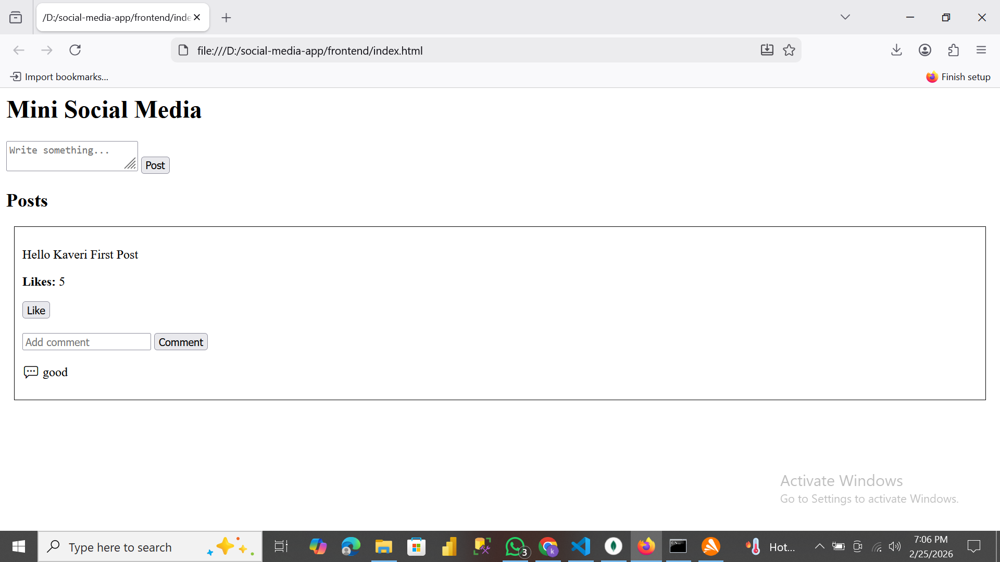

# Mini Social Media App – CodeAlpha Internship Task 2

## Project Description
This is a **backend-based Mini Social Media App** developed as part of **CodeAlpha Internship – Task 2**.  
The project focuses on **RESTful API development** and testing using **Postman**.  
Users can **register, login, create posts, follow, like, and comment on posts**.

## Features
- User Registration API  
- User Login API  
- Create Post API  
- Follow User API  
- Like Post API  
- Comment on Post API  
- MongoDB Atlas database integration  

## Technologies Used
- Node.js  
- Express.js  
- MongoDB Atlas  
- HTML, CSS, JavaScript (optional frontend)  
- Postman  

## Screenshots

**Command Run / Server Running:**  

**Like & Comment Demo:**  

**Post Created Successfully (2):**  
.png)

**Post Created Successfully:**  

**Test User Data:**  

**User Follow Success:**  

